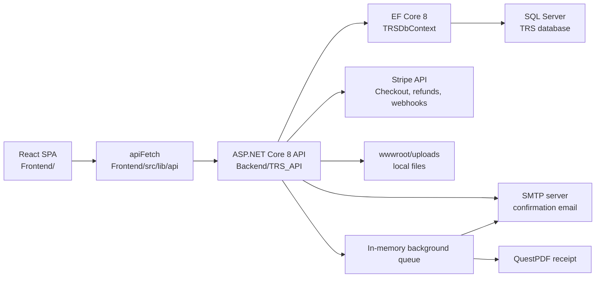
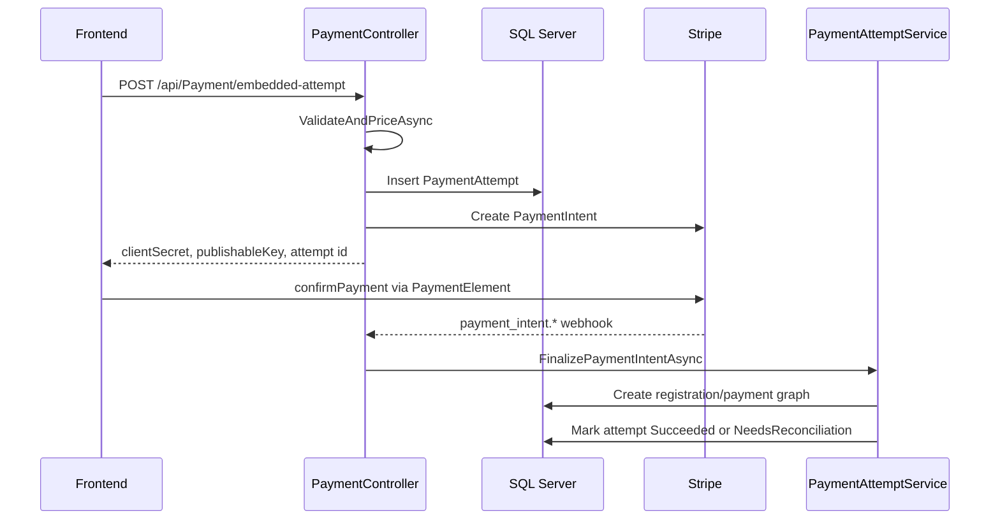

# TRS_ARCHITECTURE.md

This document describes the current technical architecture. Code is the source of truth.

## High-Level Architecture

## Frontend Architecture

### Stack

- React 18
- TypeScript
- Vite
- React Router v6
- Tailwind CSS
- Radix/shadcn-style UI components
- Lucide icons
- Quill/react-quill packages
- TanStack Query is installed, but most code uses direct imperative API calls.

### Routing

Routes live in `Frontend/src/App.tsx`.

`AdminLayout` wraps all `/admin/*` pages, checks authentication, and handles the `mustChangePassword` redirect.

### State

The frontend uses component state and React contexts:

- `AuthContext`: token lifecycle, current user, login/logout.
- `ThemeContext`: theme values.
- `LiveConfigContext`: loads public system config from `GET /api/config`.

Registration cart state lives mainly in `EventDetail.tsx`. The current paid flow uses embedded Stripe Elements in `EmbeddedPaymentModal`; cart/contact context is kept in browser storage only so refreshes or failed attempts can preserve user input.

### API Pattern

All API modules call `apiFetch` from `Frontend/src/lib/api/_base.ts`.

`apiFetch`:

- Uses native `fetch`.
- Applies configured `API_BASE`.
- Clears local auth state and redirects to `/login` on 401.
- Returns raw `Response` to wrapper modules.

Wrapper modules return `ApiResult<T>` where practical.

## Backend Architecture

### Stack

- ASP.NET Core 8
- EF Core 8
- SQL Server
- Stripe.NET
- QuestPDF
- BCrypt.Net
- HtmlSanitizer
- Serilog

### Middleware Pipeline

Current order in `Program.cs`:

1. Swagger/SwaggerUI in development.
2. HTTPS redirection outside development.
3. Security headers middleware.
4. CORS policy `AllowFrontend`.
5. Rate limiter.
6. Authentication.
7. Authorization.
8. Static files.
9. Controllers.

Security headers include CSP, `X-Content-Type-Options`, `X-Frame-Options`, and `X-XSS-Protection`.

### Controller Pattern

Controllers use attribute routing. Most admin mutations use `[Authorize(Roles = "superadmin,eventadmin")]`; user management and orphan refunds are superadmin-only.

Business logic is mixed:

- Shared registration validation/persistence is centralized in `RegistrationWorkflowService`.
- Embedded Stripe PaymentIntent attempt creation/finalization is centralized in `PaymentAttemptService`.
- Legacy hosted Checkout finalization is centralized in `PaymentFinalizationService`.
- Fixture logic is centralized in `FixtureGenerationService`.
- Status-code constants for API logic are centralized in `StatusCodesEx`.
- Admin action audit snapshots are centralized in `AdminAuditService` where implemented.
- Several controllers still directly query and mutate `TRSDbContext`.

### Service Pattern

Services are registered in DI in `Program.cs`.

- Scoped: auth, registration, embedded payment attempts, legacy payment finalization, fixtures, email, receipt.
- Singleton: background job queue.
- Hosted: background job worker and payment cleanup worker.

Stripe SDK service objects are created inline where needed instead of being injected behind an interface.

## Database Architecture

`TRSDbContext` in `Backend/TRS_Data/Models/TRSDbContext.cs` owns the EF model.

### Main Entity Groups

Configuration/auth/logging:

- `SystemConfig`
- `AdminUser`
- `AppLog`
- `AdminAuditLog`
- `AdminAuditLogDetail`
- `PaymentAuditLog`

Events and programs:

- `Event`
- `EventGalleryImage`
- `EventDocument`
- `TrsProgram` mapped to `Programs`
- `ProgramField`
- `ProgramCustomField`
- `BadmintonClub` mapped to `BadmintonClub`

Database and API status values are short codes. Events store `RegistrationStatus` as `O`, `PA`, or `CL`. Runtime registration availability is computed by the backend from stored status, Singapore date, event activity, and active program count, producing `D`, `U`, `O`, `PA`, or `CL`. Frontend UI converts codes to human-readable labels for display.

Registration:

- `EventRegistration`
- `ParticipantGroup`
- `Participant`
- `ParticipantCustomFieldValue`
- `EventParticipant` legacy model

Payment:

- `Payment`
- `PaymentItem`
- `Refund`
- `PaymentAttempt`
- `PendingCheckout`
- `WebhookLog`

Competition:

- `Fixture`
- `SbaRanking`

Jobs:

- `BackgroundJob` exists in EF, but current runtime uses the in-memory `BackgroundJobQueue`.

### Important Constraints and Indexes

- One payment per registration: `UQ_Payments_Registration`.
- Unique Stripe session/payment identifiers when present.
- One fixture per event/program: `UQ_Fixtures_EventProgram`.
- Unique admin email: `UQ_AdminUsers_Email`.
- Filtered unique orphan refund index on `Refunds.GatewaySessionId`.
- SBA ranking filtered unique indexes for singles and doubles.

### Denormalized Fields

The system intentionally stores snapshots:

- `EventRegistration.EventName`
- `ParticipantGroup.ProgramName`
- `ParticipantGroup.ClubDisplay`
- `ParticipantGroup.NamesDisplay`
- `PaymentItem.ProgramName`
- `PaymentItem.Description`
- `PaymentItem.PlayerName`
- `Payment.EventId`

These avoid expensive joins and preserve historical labels after event/program edits.

## Payment Architecture

### Embedded Payment Attempt Flow

The webhook is the source of truth for final registration creation. The browser polls attempt status and only clears the cart after the backend reports a finalized registration. Late success after attempt expiry and finalization failures are marked for reconciliation rather than auto-registering.

Registration event gating is explicit in `RegistrationWorkflowService`:

- `StrictPublic` for public direct registration and new payment attempts.
- `AdminAssisted` for logged-in admins registering from the event detail page.
- `AlreadyPaidFinalization` for payment finalization after money has already moved.

This keeps admin-assisted pre-payment registration separate from already-paid finalization bypasses.

### Legacy Hosted Checkout Flow

`PaymentController` still supports `create-checkout-session` and `confirm-session` for older hosted Checkout return URLs. That path stores payloads in `PendingCheckouts` and finalizes through `PaymentFinalizationService`.

## Background Work

Receipt generation and payment confirmation email are queued through `IBackgroundJobQueue`.

Implementation notes:

- Queue is in-memory (`Channel<Func<CancellationToken, Task>>`).
- Jobs are lost if the process restarts.
- Payment confirmation jobs generate receipt and registration-details PDFs.
- Cancellation/refund notification jobs are queued after database state is saved and batch actions send one email for the batch.
- Email failures are logged but do not retry.
- `PaymentCleanupWorker` deletes expired legacy pending checkout rows and sweeps embedded attempts for expiry/backstop reconciliation.

## Logging Architecture

Serilog is configured through `builder.Host.UseSerilog`.

Configured sinks:

- Console.
- `EFCoreSink`, writing to `AppLogs`.

`EFCoreSink` creates a scoped `TRSDbContext` per log event, writes the event, and swallows sink exceptions.

Admin audit logging is separate from application logging. `AdminAuditService` stores action-level old/new JSON snapshots in `AdminAuditLog` and flattened changed fields in `AdminAuditLogDetail`. It is used by implemented admin mutation paths such as event/program changes, fixture mutations, badminton club CRUD, and SBA import-created clubs.

## File Storage

Uploads are local disk files below API web root:

`Backend/TRS_API/wwwroot/uploads/...`

The API returns relative paths and serves them with static file middleware. There is no storage abstraction for cloud storage.

## Fixture Architecture

Fixtures are stored as rows in `Fixtures` with `BracketStateJson`.

Supported formats in current code:

- `knockout`
- `group_knockout`
- `round_robin`
- `heats`

The backend owns generation and mutation; the frontend wizard sends config and seed entries.

Generating a fixture closes the affected program to stop further registrations. Registration validation also blocks programs that already have a fixture row.

## Architectural Risks

- Public registration and receipt lookup use sequential ids.
- Uploads are unauthenticated at the controller level.
- In-memory background jobs are not durable.
- Stripe SDK is not abstracted.
- Local disk uploads are not horizontally scalable without shared storage.
- `EventParticipant` and `BackgroundJob` remain as legacy/unused EF surfaces.
- Dual registration status fields on registrations increase consistency risk.
- Event registration availability is partly stored and partly computed; frontend screens should use backend `computedRegistrationStatus` and treat frontend date logic only as fallback.
- SQL scripts exist but there are no EF migration files in the repository.
- Short-code status consistency depends on keeping backend constants, SQL constraints/scripts, and frontend label maps in sync.
